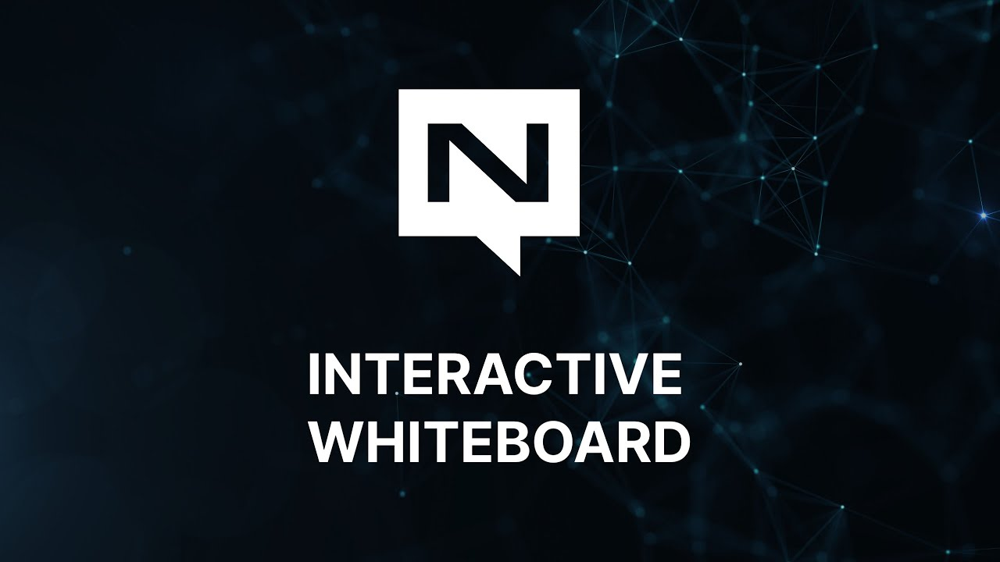

# Episode 3: Interactive Whiteboard

In this episode we create a persistent, interactive whiteboard using NATS JetStream and websockets support.

The full source code for this episode can be found [here](https://github.com/connectEverything/nats-whiteboard)
