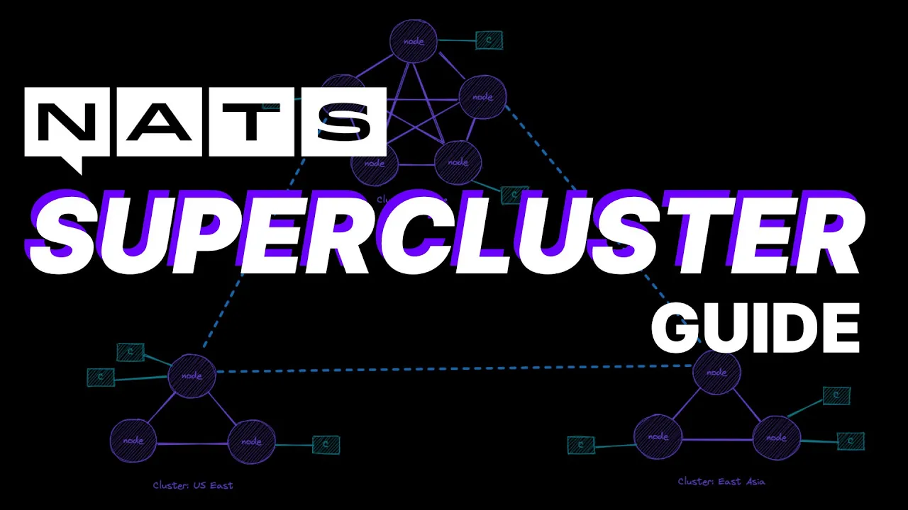

# Episode 5: Superclusters



[YouTube Link](https://youtu.be/6O_sNSJ2p70)

Episode 5 is all about expanding our example from [Episode 4](,,/04-clusters) from a single cluster into a supercluster.

To run this example, you will need to have docker installed. Simply run:

```bash
docker-compose up
```

To run the supercluster.
