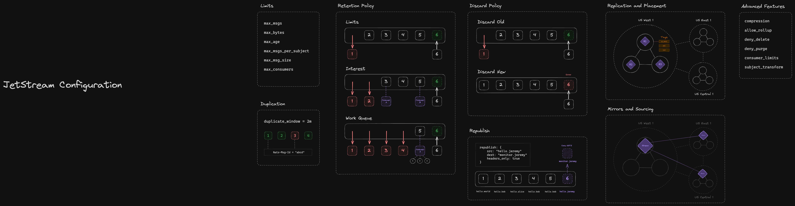

# NATS JetStream: Stream Configuration

## Drawing

## Configuring a Stream

NATS JetStream was designed to be flexible enough to accomodate multiple models of distributed persistence with a single core primitive: the Stream. In this episode, we'll go over all of the options available when configuring a Stream and some best practices on when to use them.

### The basics

These options are self-explanatory, but worth going over briefly:

`name` - The name of the Stream, used for identification of the stream for consumers, configuration and monitoring.

`description` - Description used to clarify usage of the Stream. Shows up in NATS CLI, API and other tools like [Synadia Cloud](https://www.synadia.com/cloud)

`subjects` - Subjects to listen on when persisting messages in the stream. Can use wildcards.

`storage_type` - The type of storage to use for persistence (File or Memory). Memory stores will store messages in-memory, and will not persist through NATS server restarts.

### Limits

Limits allow JetStream admins to place hard limits on Streams as well as drive how the Retention and Discard policies behave. JetStream includes many different types of limits that can be combined to create interesting storage solutions:

`max_msgs` - The maximum amount of messages allowed in the stream at a given time.

`max_bytes` - The maximum amount of total bytes allowed for the Stream.

`max_age` - The maximum age, or ttl, for all messages in the stream.

`max_msgs_per_subject` - The maximum amount of messages allowed on a per-subject basis.

`max_msg_size` - The maximum size (in bytes) of a message in a Stream

`max_consumers` - The maximum amount of consumers allowed for this stream.

### Retention Policy

In combination with Limits, the Retention policy for a stream can have a significant impact on the behaviour of the stream, below represent the types of Retention policies available for a stream:

`limits` - This is the default retention policy, and will apply the Discard Policy on messages when a limit has been reached.

`interest` - Inherits the behaviour of the `limits` policy, while also discarding messages once they have been acknowledge by all interested consumers.

`work_queue` - Inherits the behaviour of the `interest` policy, while restricting the amount of consumers to 1, simulating a durable worker queue.

### Discard Policy

The Discard policy decides what to do when a limit has been reached for a particular subject or message:

`Old` - When a limit has been reached, delete the oldest qualified message.

`New` - When a limit has been reached, reject the publishing of new messages.

### Duplication

Things can go wrong often in distributed systems, and deduplication is necessary in many circumstances. The `duplicate_window` option allows you to configure the sliding window for deduplication of your messages. In order to utilize deduplication, you must add a `Nats-Msg-Id` header to your messages. Messages that share the same ID within the window will be deduplicated automatically.

### Replication and Placement

One of the more important bits of JetStream is the ability to control where your Stream lives and how it is replicated in your NATS system. The following options allow you to control placement and replication:

`placement.cluster` - Which cluster to place this Stream on. This option can be changed after the stream is created and the stream will be moved without interruptions.

`placement.tags` - Allows the Stream to be placed on servers that has the specified tags. Useful for larger clusters or deployments.

`replicas` - The replication factor of the Stream within the cluster. Replication is done via the Raft concensus protocol, and therefore replicas are immediately consistent. We recommend making the replica factor 3/5/7 etc to maintain a tolerance for a certain amount of nodes being offline while retaining concensus.

### Mirroring and Sourcing

We'll go more in-depth on mirroring and sourcing in future episodes, but I'll explain the basics here:

`mirror` - Allows this Stream to be a 1:1 mirror of another Stream. useful for replicating Streams across Account or cluster boundaries. Mirrors of Streams will deliver messages to consumers (reads), and forward all writes to the Stream it is mirroring.

`source` - Allows this Stream to source it's data from one or more Streams. This is different from a mirror in that it is not a 1:1 copy of the source stream, but rather can be used for aggregation of streams, and can still make use of the `subjects` config option.

### Metadata

New in version 2.10 of the NATS server, `metadata` allows you to add arbitrary information to a Stream. Maybe you have a schema associated with the stream data, or a particular format you'd like to include for discovery purposes.

### Republish

While JetStream consumers are generally pretty lightweight for most applications. Very large scale consumer requirements (think millions) benefit from foregoing consumers and can instead reach for republish. Republish will optionally publish a core NATS message whenever a message has been persisted to the Stream. Republishing requires a new mapping of the subject to publish on to avoid ingest loops.

Republishing is great for monitors, metrics collectors, and anything else that doesn't need to use a consumer or can forego some temporal decoupling.

Optionally, republish can also just send headers and no payload, making them extra performant over the wire.

### Advanced Features

For more niche use cases, there are a few options I'd put into the "Advanced" category:

`compression` - Allows compression for contents of the JetStream stream (File store only)

`allow_rollup` - Allow the Stream or subjects in the stream to be "rolled up" when a `Nats-Rollup` header is included, discarding all previous messages and persisting the new one. Useful for data that can be derived, collated, or aggregated while keeping the Stream from bloating.

`deny_delete` and `deny_purge` - Disallows deleting or purging of a stream/messages.

`subject_transform` - A subject for a whole other video, `subject_transform` allows you to configure how a subject is transformed before it goes into the stream. Useful when aggregating multiple streams with the `source` option or for migrating/maintaining backward compatibility.

`consumer_limits` - Default limits to put on new consumers for this stream. Will cover more when we cover consumers in the next video.
